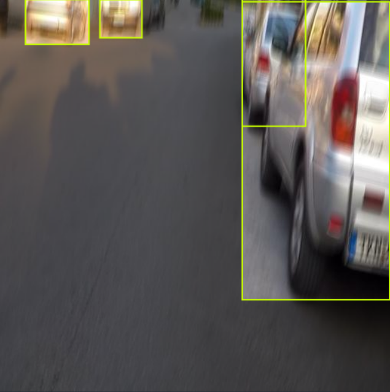
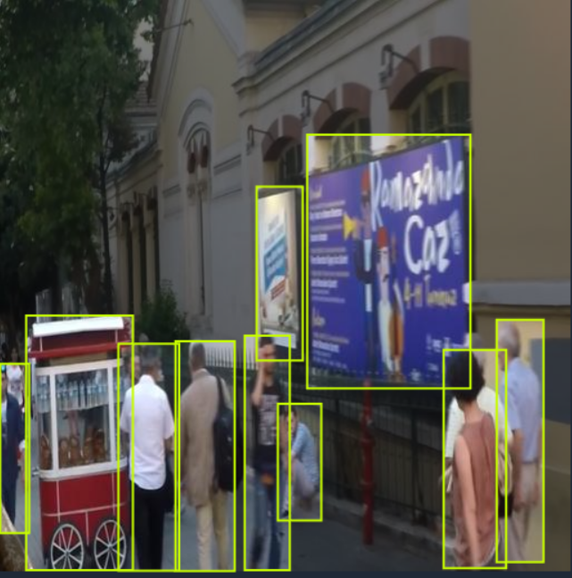
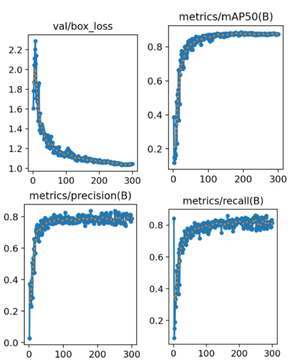
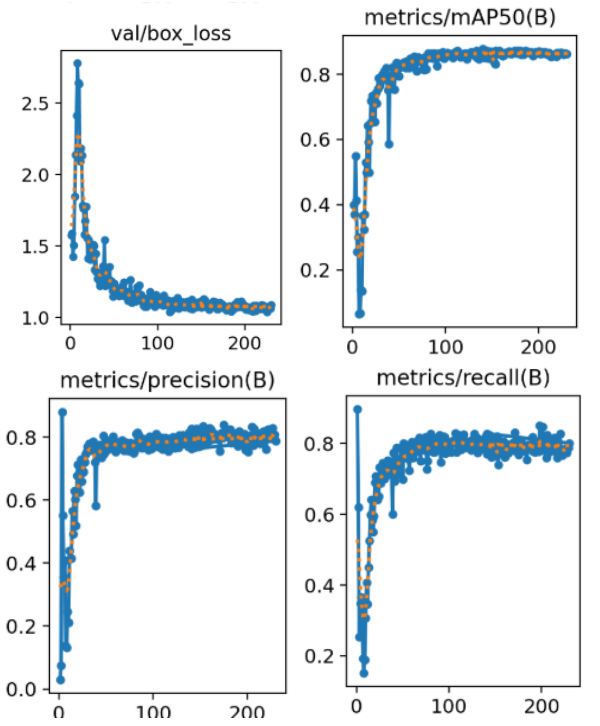

# 🚗 Blurred Image Object Detection

Obtaining high-quality data is a critical challenge in computer vision—especially for real-time applications like autonomous driving, surveillance, medical diagnostics, and computational photography. These systems often operate under degraded visual conditions caused by motion blur, defocus, atmospheric interference, or optical distortions resulting from fast-moving objects, handheld cameras, or harsh environments.

This project attempts to address that gap by training object detection models to perform reliably in blurred and noisy image conditions. We manually annotated a custom dataset using Roboflow and benchmarked YOLOv11 and YOLOv12 to assess their robustness in real-world scenarios where image degradation is unavoidable.

---

## 📁 Dataset Overview
We have taken a portion of the GoPro dataset (link below) and annotated it by adding bounding boxes around common objects and/or people present in the images to create ground truth labels. 
- **Original Dataset webpage**: [https://seungjunnah.github.io/Datasets/gopro](https://seungjunnah.github.io/Datasets/gopro)
- **Size**: 1,000+ custom-annotated images
- **Annotation Tool**: [Roboflow Annotate](https://roboflow.com/annotate)
  
## 📷 Sample Images from Annotated Dataset

  
  

🗂️ **Annotated dataset available on Roboflow Universe** 

<a href="https://universe.roboflow.com/image-deblurring/image-deblurring-ol1wo-bpcfn">
    </img>
</a>

---

## 🧠 Models & Results

We trained and evaluated two object detection models using the Ultralytics YOLO CLI:

| Model    | mAP@0.5 | Recall  | Precision |
|----------|---------|---------|-----------|
| YOLOv11  | 88.0%   | 81.9%   | 79.2%     |
| YOLOv12  | 87.3%   | 79.0%   | 80.8%     |

- **YOLOv11** achieved higher recall and overall performance on blurred objects  
- **YOLOv12** produced fewer false positives, with slightly better precision

Below, we have displayed the validation curves for box loss, mAP@0.5, precision and recall (clockwise from top left in each image group) against the number of epochs for YOLOv11 and YOLOv12 models. 

## 🧪 YOLOv11 vs YOLOv12 – Inference

  
  

  <em> &nbsp; &nbsp; &nbsp; &nbsp;&nbsp; &nbsp; &nbsp; Left:YOLOv11 output – higher recall &nbsp; &nbsp; &nbsp; &nbsp; &nbsp; &nbsp;| &nbsp; &nbsp; &nbsp; Right: YOLOv12 output – cleaner bounding box</em>

---

## 🛠 Tools & Libraries

- Python 3.x  
- [Ultralytics YOLO CLI](https://docs.ultralytics.com)  
- OpenCV  
- Roboflow Annotate  
- Jupyter Notebook (for visualization and evaluation)

